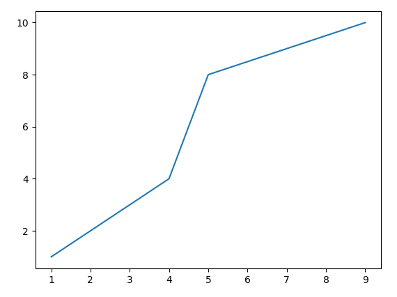
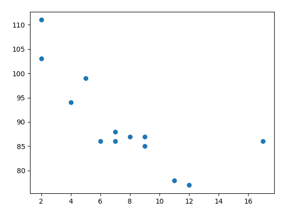
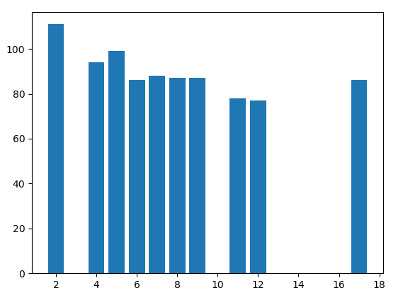
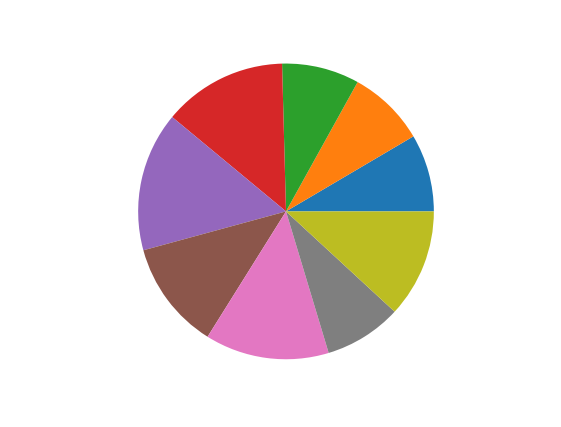

# DSL - Construcción de UN Lenguaje de dominio especifico para realizar análisis de datos

<div style='width:100%; display:flex; justify-content:space-around; margin-bottom:20px;'>


</div>


Un lenguaje de dominio especifico es una herramienta que se diseña a medida para un problema 
particular y que de una solución particular. Para este proyecto deberá utilizar ANTLRv4 para diseñar 
e implementar un lenguaje de programación que realice operaciones de análisis de datos.  

Basándose en Python, el lenguaje de programación deberá ser capaz de: 

- Hacer operaciones aritméticas: suma, resta, multiplicación, división, modulo, calculo de 
raíces de la forma x^y, operaciones trigonométricas, etc. 
- Hacer operaciones de matrices: suma, resta, multiplicación, Inversa, transpuesta 
- Realizar las operaciones de condicionales y ciclos for y/o While 
- Realizar graficas de datos. 
- Manejar archivos, lectura y escritura de archivos de texto. 

La implementación debe hacerse desde Python utilizando el patrón de diseño Visitor soportado en 
ANTLR 
El lenguaje debe ejecutarse poder tener una consola para ejecutarse y también desde un archivo 
plano. 

# How run this project?

## Step 1: Install python runtime

```bash
pip3 install antlr4-python3-runtime
```

## Step 2: use `.g4` to generate parser and lexer 

```bash
antlr4 -Dlanguage=Python3 lenguaje.g4 -visitor -o dist 
```
Use `-visitor` to generate Visitor Class
Use `-o` to specify output path.

## Step 3: Modify ejemplo.txt

En este archivo de texto están las operaciones que queremos realizar en la calculadora.
```bash
nano ejemplo.txt
```

## Step 4: Execute python file

```bash
python3 main.py
```

# Docs

## Operaciones Aritmeticas

- Suma (+), multiplicación(*), división(/), potencia(^), modulo(%), raiz
```python
x = 2+1
x = 3-2
x = 4*2
x = 10/5
x = 2^5
x = 2%2
x = root(9) # Raiz Cuadrada
x = root(9,3) # Raiz cubica de 9
x = root(9,4) # Raiz cuarta de 9

```

## Operaciones Trigonometricas

- sin, cos, tan

```python
sin(90)
cos(0)
tan(180)
```

## Operaciones entre matrices

```python
[[4,3],[3,1]] + [[5,4],[8,6]] # suma
[[4,3],[3,1]] - [[5,4],[8,6]] # resta
[[4,3],[3,1]] * [[5,4],[8,6]] # Producto punto | Multiplicación
inverse([[4,3],[3,1]]) # Inversa
transposed([[4,3],[3,1]]) # Transpuesta
```

## Condicionales y Ciclos

### Condicional If

```python
if(4==4)->{
    show("4")
} else ->{
    show("2")
}
```

### Ciclo For

```python
for(i=0;i=10)->{
    show("Hola")
}
```

### Ciclo While

```python
i = 0

while(i <= 10)->{
    i = i + 1
    show(i)
}
```

## Graficos de datos

### Paint
La función ***paint*** es usada para graficar puntos en un diagrama

```python
a = [1,4,5,9]
b = [1,4,8,10]

paint(a,b)
```



### PaintBall
La función ***paintball*** es ideal para hacer un grafico de dispersión.

```python
a = [1,4,5,9]
b = [1,4,8,10]

paintball(a,b)
```



### PaintBars
La función ***paintbars*** es ideal para realizar diagramas de barras.

```python
a = [5,7,8,7,2,17,2,9,4,11,12,9,6]
b = [99,86,87,88,111,86,103,87,94,78,77,85,86]

paintbars(a,b)
```



### Brownie
La función ***Brownie*** es ideal para realizar diagramas de tortas.

```python
a = [5,5,5,8,9,7,8,5,7]

brownie(a)
```



## Manejo de archivos

```python
leer("archivo.txt")
escribir("archivo.txt", "Hola mundo, estoy haciendo mi primer lenguaje de programacion!!")
```

# Integrantes

- Angie Ruiz 🧑‍💻
- Ricardo Rey 🧑‍💻